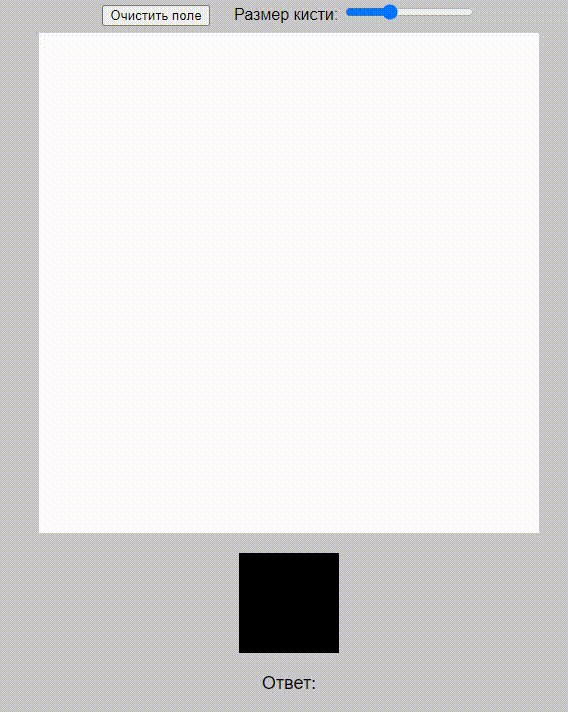

# Mnist 

---
Приложение с веб-интерфейсом для определения рукописных цифр.

## Реализация

---
- Проект разделен на 2 модуля:
    - Тренировочный модуль написанный почти на голом **C++** без использования библиотек для нейронных сетей.
      В нем используется параллелизация процесса обучения для его ускорения. После завершения обучения модуль сохраняет веса в `.json`.
    - Модуль с веб-интерфейсом, который подгружает веса из `.json` и использует их для классификации.
- В основе проекта лежит полносвязный многослойный перцептрон с прямым распространением.
- В качестве тренировочного датасета используется [mnist](https://en.wikipedia.org/wiki/MNIST_database) - датасет образцов рукописного написания цифр.
- В качестве функции активации используется [сигмоида](https://en.wikipedia.org/wiki/Sigmoid_function).
- Для обучения используется метод обратного распространения ошибки([backpropagation](https://en.wikipedia.org/wiki/Backpropagation)).

## Функционал:

---
1. Поле для рисования цифры.
2. Ползунок для изменения размера кисти.
3. Кнопка для очистки поля.
4. Поле с предсказанным ответом.

